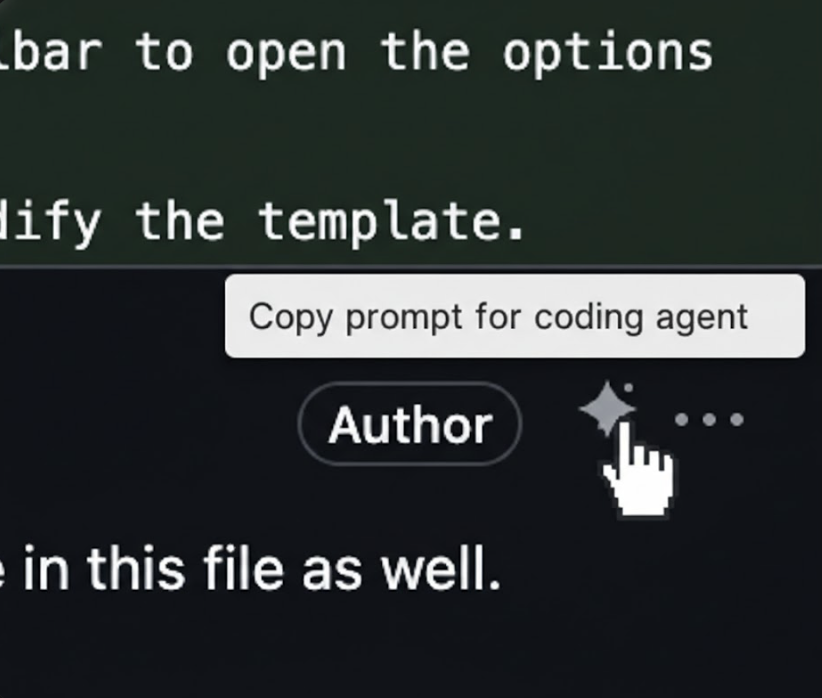

# PR Comment Prompter

A Chrome extension that adds a one-click button to GitHub PR comments for copying a prompt to your clipboard — ready to paste into a coding agent (Claude, Copilot, Cursor, etc.).

## Installation

1. `bun install && bun run build`
2. Open `chrome://extensions` → enable Developer mode → Load unpacked → select `dist/`

## Template customization

Click the extension icon in the Chrome toolbar to open the options page.
You can modify the template.
